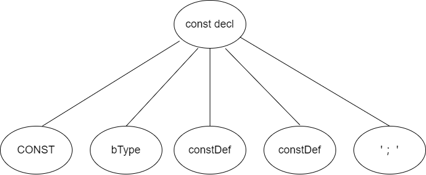

[TOC]

# 编译原理研讨课实验PR002实验报告

## 任务说明
在实验PR001中我们已经对CACT语言源代码(.cact文件)进行了词法和语法分析，得到了语法分析树。在本实验中，我们将
- 根据给出的CACT文法和语义规范，进一步完善.g4文件；
- 通过Antlr生成的访问语法树的接口，对输入的CACT语言源代码(.cact文件)进行语义分析；
- 遇到语义错误时，进行相应的处理。

## 成员组成
| 姓名 | 学号 | 
| :--: | :--: |
| 吴俊亮 | 2018K8009929048 |
| 贾志杰 | 2018K8009929040 |
| 陈天宇 | 2018K8009929028 |

## 实验设计

### 参考资料
[CACTcompiler](https://github.com/zhangshuoming990105/CACTcompiler)

### 设计思路
1. 符号表

    符号表收集记录编译源程序过程中语法符号的相关信息，包括变量信息、函数信息、块信息等。本次实验中符号表相关设计涉及符号表的数据结构设计和符号表的相关操作实现。

2. 语义分析

    语义分析的任务是对结构上正确的源程序进行进一步处理：审查源程序有无语义错误，为代码生成阶段收集类型信息。
    
    语义分析的过程大致为：对语法分析树进行遍历，填充符号表并根据符号表中信息进行语义检查，在遍历过程中抓取语义错误，发现错误时进行相应报错输出。

### 实验实现
1. 符号表的数据结构

    符号表条目包括块信息条目、变量信息条目和函数信息条目。
    
    块信息条目包括行号、包含的块的符号表条目索引（不妨将嵌套的块称为子块）和在本块中定义的变量的符号表条目索引。

    变量信息条目包括变量的类型（int/boool/float/double）、变量的种类（常量/变量/常量数组/变量数组/函数参数）、多路复用的域length（记录常量的值/数组的长度/参数的位置）、行号、全局变量标志和变量名称。

    函数信息条目包含函数返回值的类型、参数的个数、行号、函数名称和参数块的符号表条目。

    ```cpp
    struct VarInfo
    {
        int cls;
        int type;
        int length;
        int line;
        int global = 0;	
        std::string name;
    };

    struct BlockTable
    {
        int line;
        std::map<int, struct BlockTable *> sub_blocks;
        std::map<std::string, VarInfo> local_symbols;
    };

    struct FuncInfo
    {
        int cls;
        int param_num;
        int line;
        struct BlockTable base_block;
        std::string name;
    };
    ```
    符号表需要记录的信息包括：

    1. 从全局变量名称到对应的符号表条目的映射；
    2. 从函数名称到对应的符号表条目的映射；
    3. 块对应的符号表条目的栈；
    4. 当前函数的名称；
    5. 临时变量的数目；

    ```cpp
    class SymbolTable
    {
    public:
        std::map<std::string, VarInfo> global_symbols;
        std::map<std::string, FuncInfo> func_symbols;
        std::string cur_func;
        std::vector<BlockTable *> block_stack;
        int temp_var_count;
    };
    
    // 成员函数
    // ...
    ```

2. 符号表的相关操作

    我们主要实现了以下成员函数以实现对符号表的添加和查找功能。
    ```cpp
    class SymbolTable
    {
    // 成员变量
    // ...

    public:
        SymbolTable()
        {
            temp_var_count = 0;
            cur_func = "$";
            block_stack.push_back(nullptr);
        }

        VarInfo *lookup(const std::string &name); 				// 查找变量
        FuncInfo *lookup_func(const std::string &func_name);	// 查找函数
        VarInfo *lookup_param(FuncInfo &func, int para_idx);	// 查找函数参数
        
        void addSymbol(std::string name, int cls, int type, int length, int line);
        void addFunc(std::string name, int return_class, int param_num, int line);
        void addBlock(int line);

        std::string gen_Temp_Var(int lc, int cls, SymbolTable& st, int type = TYPE_VAR);
        std::string gen_Temp_Array(int lc, int cls, int size, SymbolTable& st);

        void printSymbol(std::ofstream &o);
    };
    ```

    函数`lookup`返回变量名对应的符号表条目。因为嵌套作用域规则，我们不仅需要在当前块的符号表中查找，还需要依次查找栈中所有块的符号表和全局变量表。

    函数`lookup_func`返回函数名对应的符号表条目。

    函数`lookup_param`根据函数的符号表条目返回其第`para_idx`个参数的符号表条目。参数的符号表条目位于函数的参数块（`func.base_block`）中。

    函数`addSymbol`在当前块的符号表中增加一个变量信息的条目。我们需要检查相同作用域中没有同名的变量。若该变量位于函数作用域，它也不能和函数参数名相同。

    函数`addFunc`增加一个函数信息的条目。我们需要检查没有同名的函数。同时需要修改`cur_func`并将函数的参数块入栈。

    函数`addBlock`创建一个新的块信息的条目，加入当前块的子块中并入栈。

    函数`gen_Temp_Var`和`gen_Temp_Array`创建临时变量/临时变量数组并将其加入符号表中。

    函数`printSymbol`可以将符号表打印到文件中用于分析。

3. 语义分析过程

    首先介绍对g4文件的修改。此次实验我们更清晰的划分了词法分析和语法分析，由词法分析器负责识别例如“int”的词素并返回词法单元INT。部分非终结符的不同产生式有截然不同的含义，我们可以通过添加标签来区分，例如

    ```
    stmt
        : lVal '=' exp ';'                           # assignStmt
        | (exp)? ';'                                 # exprStmt
        | block                                      # blockStmt
        | IF '(' ifCond ')' stmt                     # ifStmt
        | IF '(' ifCond ')' stmt elseStmt            # ifElseStmt
        | WHILE '(' whileCond ')' stmt               # whileStmt
        | BREAK ';'                                  # breakStmt
        | CONTINUE ';'                               # continueStmt
        | RETURN (exp)? ';'                          # returnStmt
        ;
    ```

    为部分非终结符添加综合属性以实现类型检查等功能。表达式相关的非终结符有综合属性`cls`表示类型，在语法分析树中该信息从叶子节点（对应词法单元）向内部节点（对应非终结符）传递。
    
    语义分析主要在遍历语法分析树结点的过程中实现，我们可以通过Antlr生成的访问语法分析树的接口，覆盖进入节点和退出节点的函数来实现我们需要的功能。在语义分析的过程中需要符号表、是否在函数内标志和类型栈（用于传递继承属性）。

    ```cpp
    class SemanticAnalysis : public CACTBaseListener
    {
    public:
        SymbolTable sym_table;
        bool in_func;
        std::stack<std::string> u_stack;

    // ...
    ```

    下面介绍如何在遍历语法分析树节点的过程中进行语义分析：

    - 开始符号

        进入根节点意味着语义分析的开始，此时我们需要进行必要的初始化工作，例如将库函数加入符号表中。

        离开根节点意味着语义分析的结束，此时我们需要检查源代码是否包含`main`函数，即符号表中是否有相关条目。

    - 常量定义

        定义常量时需要将类型信息从语法分析树的左侧节点传递到右侧兄弟节点。我们可以看一个例子，语句`const int a = 4, b = 5;`的语法分析树大致如下图所示，类型信息需要从`bType`（对应语句中的`int`）传递到右侧两个`constDef`（对应语句中的`a = 4`和`b = 5`）。
        
        
        可以将类型看作是一个继承属性，此处我们使用栈来实现。进入`ConstDecl`节点时将类型信息入栈，退出该节点时出栈。

        节点`ConstDefVal`定义了一个常量，我们进入节点时获取常量名、常量值和类型（从栈中），若类型未定义或常量值和类型不匹配则报错，否则将其加入符号表中。

        节点`ConstDefArray`定义了一个常量数组。我们进入节点时需要检查数组长度是否为正整数，类型是否为int/bool/float/double。对于每一个初始化的值检查类型是否匹配，检查初始化的值的数量是否超过了数组长度。

    - 变量定义

        与常量定义处理方法基本相同，但变量可以不赋初值，因此分为4种情况讨论。

    - 函数定义

        进入`FuncDef`节点时需要获得函数名称与返回值类型，判断函数返回值类型，如果返回值类型不是int/bool/float/double/void其中之一，则返回值类型错误。如果是main函数，那么要判断其是否有参数和返回值类型，如果其有参数或返回值类型不是int，则报错。之后我们将函数添加到符号表中，并将参数加入函数的参数块中，同时检查参数类，记录函数参数数量。

        退出`FuncDef`节点时，修改当前函数为`"$"`表示在函数外，将函数的参数块出栈。

    - 块

        进入`Block`节点时将块加入符号表中，退出时将块出栈。

    - 语句

        退出赋值语句节点`AssignStmt`时，若左值是数组访问，需要检查偏移值是否为整数。随后需要检查左值和右值是否已定义，类型是否相同。此外，左值不能是常量、右值类型不能是void。若是Element Wise操作还需检查数组长度是否匹配。

        退出Return语句节点`ReturnStmt`时需要检查返回值类型和函数的参数表条目记录的返回值类型是否匹配。

        退出条件语句节点`Cond`时需要检查是否为bool类型。

    - 表达式

        退出节点`LVal`时，若产生式是`Lval -> Ident`，则检查变量是否已定义；若产生式是`Lval -> Ident '[' exp ']'`，则检查数组是否已定义、偏移值是否为整数。

        进入节点`Funcall`时意味着调用了函数，需要检查参数个数是否和函数的符号表条目记录的相同。退出节点`Funcall`时逐个检查实参形参是否类型对应，并检查函数有无返回值。

        退出节点`Unary`时需要检查一元运算符和变量类型是否匹配。

        退出二元运算符相关的节点时，我们检查两侧的类型，若是Element Wise操作需要检查其长度是否一致，同时不能出现数组和变量运算的情况。同时需要考虑二元运算符支持的类型，例如bool型变量不能相乘，比较运算不支持Element Wise操作等。

    操作在进入节点时完成还是退出节点时完成主要取决于其是否依赖于子节点的综合属性。以节点`Funcall`为例，进入节点时不知道子节点的类型（实参的类型），只知道子节点的数量，所以在进入时检查参数个数，在退出时检查参数类型。

    另外，退出带有综合属性的节点时需要根据子节点的综合属性的值对其赋值，例如`a+b`的类型是`a`的类型或`b`的类型。

## 实验结果

### 自动化测试

我们编写了test.sh用于自动化测试，根据文件名中的"true"和"false"对比编译的返回值确定编译器是否正常工作。
```sh
#! /bin/sh
cd ../grammar
java -Xmx500M -cp "/home/compiler15/lib/antlr-4.8-complete.jar:$CLASSPATH" org.antlr.v4.Tool -Dlanguage=Cpp CACT.g4
cd ../build
cmake ..
make

SAMPLES_NUM=47

for file in `ls ../samples/samples_semantic`; do
    num="${file%%_*}"       # 获取测试文件序号
    num=$[10#$num]          # 转为十进制
    array_name[$num]=$file  # 将映射存在数组中
done

for ((p=0;p<=$SAMPLES_NUM;p=p+1)) do
    ./compiler ../samples/samples_semantic/${array_name[$p]} &> /dev/null # 进行测试
    RETURN=$?   # 获取返回值

    var=${array_name[$p]}
    a="${var#*_}"
    a="${a%%_*}"        # 获取文件名中的true/false

    if  test $a = "true" && test $RETURN = "1"
    then
        echo Error occurs "while" compiling ${var##*/}
    fi
    if  test $a = "flase" && test $RETURN = "0"
    then
        echo Error occurs "while" compiling ${var##*/}
    fi   
done
```

### 测试方法

编译源文件时，可以在源文件名后增加一个可选的参数：输出符号表文件名。例如./compiler src.cact syt_table.txt会将源码对应的符号表输出到文件syt_table.txt中。

### 特殊情况

虽然实验说明中告知“语义分析阶段给出的测试样例，均无词法和语法错误”，但由于文法定义不同这不是绝对的。例如下面的语句我们设计的文法无法推出，所以会报出“Syntax Error”。

```c
int b = {1, 2, 3, 4};
```

## 总结

### 实验结果总结
本次实验主要实现了符号表以及语义分析的设计。符号表在分析阶段起着至关重要的作用，通过本次实验加深了对符号表的构造机制与管理方法的理解。语义分析是编译过程的重要阶段，对语义分析的实现过程加深了我们对编译过程的理解。
### 分成员总结
1. 吴俊亮

本次实验中我在理解小组其他成员编写的代码的基础上对代码做了优化，模仿gcc的报错信息统一了报错信息的格式，删除了部分冗余的代码以及增加了队友没有考虑到的（也是测试样例中未出现的）语义错误情况。正好理论课也正在讲解语法制导的翻译，本次实验加深了我对“综合属性”、“继承属性”以及类型检查等内容的理解。

2. 陈天宇

在本次实验中我编写了自动化测试脚本，在理解成员编写代码的基础上完成了实验报告初稿。通过本次实验我加深了对语义分析过程的理解，进一步理解了编译程序的运作机制。

3. 贾志杰

在本次实验中，我主要负责框架的构建和主要代码的编写。首先是符号表，符号表是语义分析的基础，重点是为函数、变量等选择适合的数据结构，以及维护不同block间的符号表嵌套关系，最后根据语义分析的实际需要，设计一些填充符号表的函数接口。其次是g4文法的修改，把语法规则里的字符串匹配归入词法规则，在语法里只出现token作为最小单元；在多产生式部分添加标签以处理不同情况；设计综合属性传递值、设计继承属性传递类型。最后是语义分析，主要通过在语法各个节点的进入和结束时调用相应函数来处理。这里情况较多，具体来说一般定义声明类的在进入时处理，运算类的在进入时传递继承属性，在结束时进行具体处理。通过这次实验我实际体会了符号表的构建、语法分析的流程，这让我对理论课上讲的属性文法、语法制导翻译有了更深的理解。
